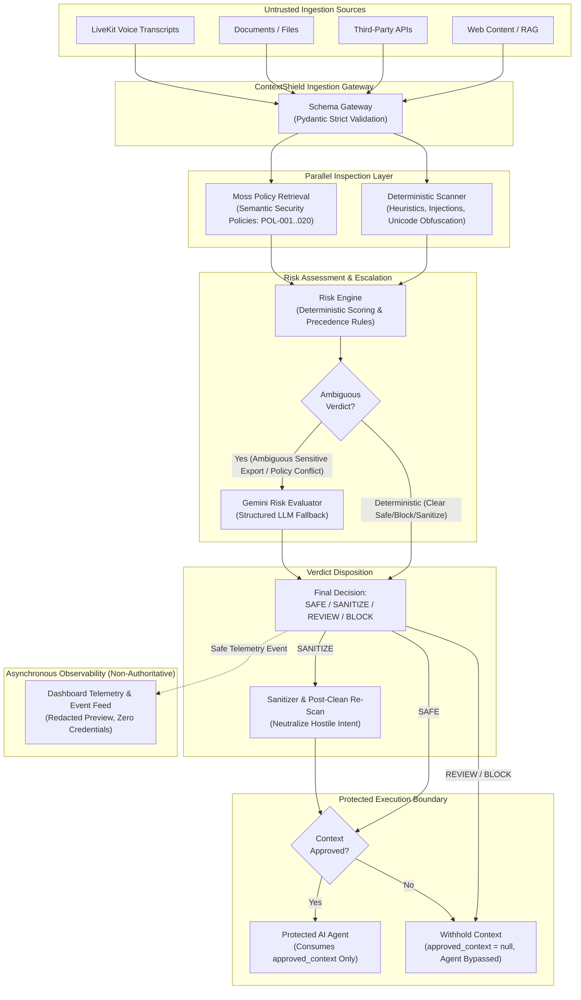
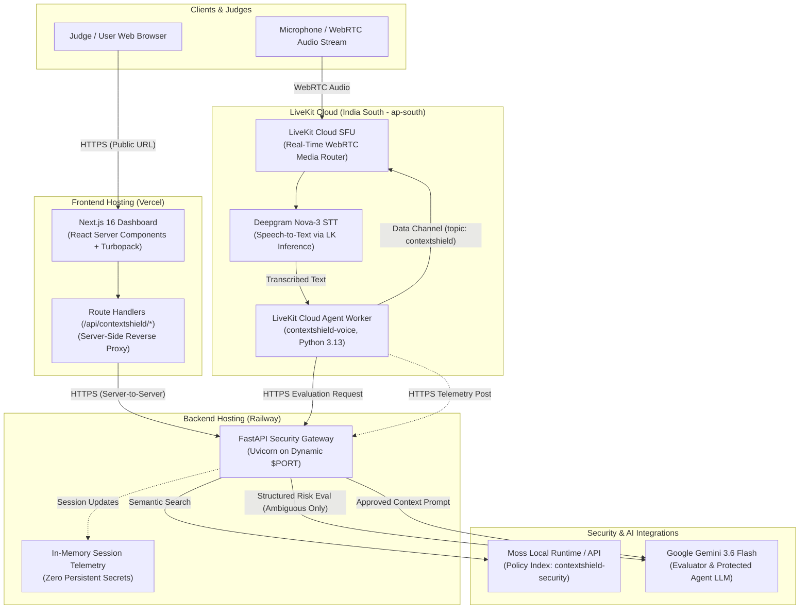
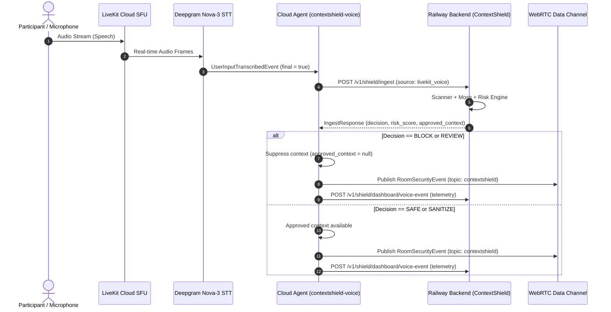

# ContextShield — Technical Architecture Specification

ContextShield is a low-latency, defense-in-depth security gateway that intercepts, evaluates, and neutralizes untrusted external context before an autonomous AI agent is permitted to ingest it.

---

## 1. System Overview & Core Invariants

The primary security invariant of ContextShield is:

> **Downstream AI agents never consume raw external context directly.**

Context reaches downstream AI reasoning engines if and only if ContextShield assigns a verdict of **SAFE** or **SANITIZE**. In all other cases (**REVIEW**, **BLOCK**), context delivery is withheld (`approved_context = null`), and downstream reasoning execution is bypassed entirely.

### Key Architectural Principles

1. **Defense-in-Depth Pipeline**: Combines deterministic regex/heuristic scanning, configured Moss semantic policy retrieval, and a calibrated Risk Engine with Gemini structured evaluation as an escalation layer for ambiguous contexts.
2. **Deterministic Sovereignty**: Deterministic CRITICAL findings cannot be downgraded by probabilistic model output.
3. **Fail-Secure Defaults**: Any upstream timeout, rate limit (HTTP 429), schema malformation, or internal service exception automatically fails closed to `REVIEW` or `BLOCK` with `approved_context = null`.
4. **Decoupled Telemetry**: Telemetry and audit logging are strictly read-only and non-authoritative. A failure in the telemetry subsystem cannot alter or impede security enforcement.

---

## 2. Security Decision Pipeline

The flowchart below illustrates the complete evaluation lifecycle from untrusted ingestion to downstream agent consumption.

---

## 3. Pipeline Stages in Detail

### Stage 1: Schema Gateway
- Enforces strict Pydantic models with `extra="forbid"` and explicit string length boundaries.
- Rejects malformed JSON, prototype pollution attacks, or unexpected schema modifications before processing.
- Preserves raw input byte streams (including zero-width obfuscation sequences) for scanner inspection.

### Stage 2: Parallel Inspection (Deterministic Scanner + Moss Policy Retrieval)
- **Deterministic Scanner**: Runs regex patterns and character-level heuristic checks covering:
  - Instruction override signatures (`RULE-IO-001`, `RULE-IO-002`, `RULE-IO-003`)
  - Credential solicitation & exfiltration attempts (`RULE-EX-001`, `RULE-EX-002`)
  - Role manipulation & privilege escalation (`RULE-RM-001`)
  - System prompt extraction (`RULE-SP-001`)
  - Unicode/zero-width evasion obfuscation (`RULE-ZW-001`)
- **Moss Semantic Policy Retrieval**:
  - Connects to the local/hosted Moss runtime loaded with the `contextshield-security` index (20 dynamic enterprise security policies).
  - Retrieves semantic candidate matches with confidence scores.
  - Guarantees that retrieved policies serve as corroborating criteria rather than authoritative overrides.

### Stage 3: Deterministic Risk Engine
- Assesses findings against fixed precedence rules:
  1. **Precedence A (CRITICAL Deterministic Finding)**: Immediate `BLOCK` (Risk = 90–100).
  2. **Precedence B (Exfiltration Intent)**: Immediate `BLOCK` (Risk = 95).
  3. **Precedence C (Multiple Aligned Moss Critical Policies)**: Confirmed `BLOCK` (Risk = 85).
  4. **Precedence D (Isolated Low-Risk Hostile Segment)**: `SANITIZE` (Risk = 45).
  5. **Precedence E (Ambiguous Sensitive Directive)**: Escalates to `REVIEW` or Gated LLM Evaluation.
  6. **Precedence F (Clean Payload)**: `SAFE` (Risk = 0).

### Stage 4: Gated Gemini Risk Evaluator
- Invoked **only** when the input is classified as ambiguous.
- Employs strict structured JSON schema output (`decision`, `risk_score`, `threat_categories`, `reasoning`).
- **Safety Invariant**: Gemini can escalate a verdict (e.g. from `REVIEW` to `BLOCK`) but can **never** downgrade a deterministic `BLOCK` or `REVIEW` floor to `SAFE`.
- **Fault Tolerance**: If Gemini times out, experiences rate limits (`RESOURCE_EXHAUSTED` / HTTP 429), or outputs malformed schema, ContextShield fails secure to `REVIEW` or `BLOCK`.

### Stage 5: Sanitizer & Post-Sanitization Verification
- Extracts and strips identified malicious imperatives from the surrounding benign documentation.
- Inserts an immutable audit marker: `[SANITIZED_UNTRUSTED_INSTRUCTION: RULE-ID]`.
- **Re-scan Verification**: Passes the sanitized output through a secondary deterministic scan. If any hostile residue remains (e.g., dangling exfiltration phrases), the payload is automatically escalated to `BLOCK` and context is withheld.

### Stage 6: Protected Agent Boundary
- The downstream `ProtectedAgent` interface enforces that callers provide `approved_context`.
- If the decision is `BLOCK` or `REVIEW`, `approved_context` is `None`, and the agent's LLM reasoning call is never initiated.
- The downstream agent never receives raw external context.

---

## 4. Production Deployment Architecture

ContextShield is deployed publicly across three specialized cloud platforms with zero dependencies on local infrastructure or developer machines.

### Component Breakdown

| Platform | Role | Technology | Configuration & Networking |
| :--- | :--- | :--- | :--- |
| **Vercel** | Public Dashboard UI | Next.js 16, TypeScript, Tailwind/Vanilla CSS | `CONTEXTSHIELD_BACKEND_URL` configured server-side. No client credentials exposed. |
| **Railway** | Central Security Gateway | Python 3.10+, FastAPI, Uvicorn | Bound to dynamic `0.0.0.0:${PORT}`. Healthcheck at `/v1/shield/health`. |
| **LiveKit Cloud** | Real-Time Voice Gateway | `livekit-agents` worker (`contextshield-voice`) | Deployed in region `ap-south`. Deepgram Nova-3 STT. Evaluates against Railway HTTPS. |
| **Moss** | Policy Index | Moss Python SDK (`moss==1.12.0`) | 20 security policies in index `contextshield-security`; retrieval timing is measured per request when the runtime is ready. |
| **Google Gemini** | Fallback Evaluation & Agent | `google-genai` (`gemini-3.6-flash`) | Gated evaluation with latency target 800ms, hard timeout 1500ms. |

---

## 5. LiveKit Cloud Voice Ingestion Pipeline

### Voice Safety Principles
1. **Transcription-Only Mode**: The voice worker operates strictly as a security listener and raises `StopResponse()` to eliminate conversational audio synthesis.
2. **Final Transcripts Only**: Interim, uncommitted voice fragments are ignored to prevent partial or out-of-order evaluations.
3. **Clean Payloads in Events**: The `RoomSecurityEvent` published to the room data channel contains decisions, threat categories, and risk scores, but **never** the raw hostile transcript or intercepted credentials.

---

## 6. Privacy & Telemetry Guardrails

- **Zero Credential Persistence**: API keys, access secrets, and authorization headers are never logged, stored in telemetry, or forwarded downstream.
- **Redacted Previews**: Untrusted context in audit events is truncated to a safe 60-character preview with detected secrets redacted to `[REDACTED_SECRET]`.
- **In-Memory Session Telemetry**: The telemetry store maintains bounded circular buffers in process memory. No external database or long-term storage of user inputs exists in the hackathon deployment.
